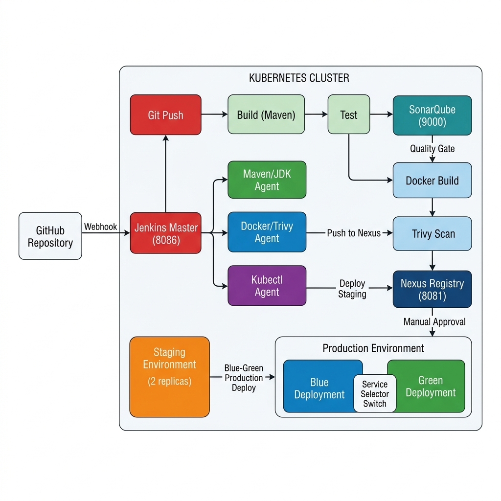

# 🚀 Dynamic CI/CD Pipeline with Jenkins on Kubernetes

[](https://www.jenkins.io/)
[](https://kubernetes.io/)
[](https://www.sonarqube.org/)
[](https://www.docker.com/)
[](https://spring.io/projects/spring-boot)

An enterprise-grade CI/CD pipeline built with Jenkins running on Kubernetes, featuring dynamic agent provisioning, automated quality gates, security scanning, and blue-green production deployments.

---

## 📋 Table of Contents

- [Architecture Overview](#-architecture-overview)
- [Features](#-features)
- [Prerequisites](#-prerequisites)
- [Quick Start Guide](#-quick-start-guide)
- [Pipeline Stages](#-pipeline-stages)
- [Blue-Green Deployment](#-blue-green-deployment)
- [Project Structure](#-project-structure)
- [Configuration](#-configuration)
- [Credentials Setup](#-credentials-setup)
- [Webhook Configuration](#-webhook-configuration)
- [Troubleshooting](#-troubleshooting)
- [Operating Guide](#-operating-guide)

---

## 🏗️ Architecture Overview



### Detailed Component Layout

```
┌─────────────────────────────────────────────────────────────────────────┐
│                        KUBERNETES CLUSTER                               │
│                                                                         │
│  ┌─────────────────────────────────────────────────────────────────┐    │
│  │                    JENKINS NAMESPACE                             │    │
│  │                                                                 │    │
│  │  ┌─────────────────┐    ┌─────────────────────────────────┐    │    │
│  │  │  Jenkins Master  │    │    Dynamic Agent Pods            │    │    │
│  │  │  (StatefulSet)   │───▶│                                 │    │    │
│  │  │                  │    │  ┌──────────┐ ┌──────────────┐ │    │    │
│  │  │  Port: 8086      │    │  │maven-jdk │ │ docker-agent │ │    │    │
│  │  │  PVC: 20Gi       │    │  │          │ │              │ │    │    │
│  │  │                  │    │  │• Maven   │ │• Docker DinD │ │    │    │
│  │  │  Plugins:        │    │  │• JDK 17  │ │• Trivy       │ │    │    │
│  │  │  • Kubernetes    │    │  │• Sonar   │ │              │ │    │    │
│  │  │  • SonarQube     │    │  └──────────┘ └──────────────┘ │    │    │
│  │  │  • Blue Ocean    │    │                                 │    │    │
│  │  │  • Docker        │    │  ┌──────────────┐              │    │    │
│  │  │  • Credentials   │    │  │ kubectl-agent│              │    │    │
│  │  │  • Lockable Res  │    │  │              │              │    │    │
│  │  └─────────────────┘    │  │• kubectl     │              │    │    │
│  │                          │  └──────────────┘              │    │    │
│  │                          └─────────────────────────────────┘    │    │
│  └─────────────────────────────────────────────────────────────────┘    │
│                                                                         │
│  ┌──────────────────────────┐  ┌──────────────────────────────────┐    │
│  │   DEVOPS-TOOLS NAMESPACE │  │      STAGING NAMESPACE           │    │
│  │                          │  │                                  │    │
│  │  ┌──────────┐            │  │  ┌──────────────────────────┐   │    │
│  │  │SonarQube │            │  │  │  pipeline-demo-app       │   │    │
│  │  │Port: 9000│            │  │  │  Replicas: 2             │   │    │
│  │  └──────────┘            │  │  │  NodePort: 30180         │   │    │
│  │  ┌──────────┐            │  │  │  Auto-deployed           │   │    │
│  │  │  Nexus   │            │  │  └──────────────────────────┘   │    │
│  │  │Port: 8081│            │  │                                  │    │
│  │  │Docker:   │            │  └──────────────────────────────────┘    │
│  │  │Port: 8082│            │                                          │
│  │  └──────────┘            │  ┌──────────────────────────────────┐    │
│  └──────────────────────────┘  │    PRODUCTION NAMESPACE          │    │
│                                 │                                  │    │
│                                 │  ┌────────────┐ ┌────────────┐  │    │
│                                 │  │    BLUE    │ │   GREEN    │  │    │
│                                 │  │ Deployment │ │ Deployment │  │    │
│                                 │  │ Replicas:3 │ │ Replicas:3 │  │    │
│                                 │  └─────┬──────┘ └─────┬──────┘  │    │
│                                 │        │              │         │    │
│                                 │   ┌────▼──────────────▼────┐   │    │
│                                 │   │   Production Service   │   │    │
│                                 │   │   (selector switch)    │   │    │
│                                 │   │   NodePort: 30280      │   │    │
│                                 │   └────────────────────────┘   │    │
│                                 └──────────────────────────────────┘    │
└─────────────────────────────────────────────────────────────────────────┘

External:
  ┌──────────┐        ┌──────────────┐
  │  GitHub   │──webhook──▶│   Jenkins    │
  │   Repo    │        │   Master     │
  └──────────┘        └──────────────┘
```

### Pipeline Flow Diagram

```
 Git Push → Webhook → Jenkins Pipeline
                         │
                         ▼
                ┌─────────────────┐
                │  1. Checkout    │
                └────────┬────────┘
                         │
                         ▼
                ┌─────────────────┐
                │  2. Build &     │  [maven-jdk agent]
                │     Test        │  mvn clean verify
                │  (compile +    │  JUnit 5 + JaCoCo
                │   test + JAR)  │  stash JAR artifact
                └────────┬────────┘
                         │
                         ▼
                ┌─────────────────┐
                │ 3. SonarQube    │  [maven-jdk agent]
                │    Analysis     │  (sequential, uses
                │                 │   test coverage data)
                └────────┬────────┘
                         │
                         ▼
                ┌─────────────────┐
                │ 4. Quality Gate │  ← Fails if not met
                └────────┬────────┘
                         │
                         ▼
                ┌─────────────────┐
                │ 5. Docker Build │  [docker-agent]
                │    & Push       │  unstash JAR → build
                │                 │  → Nexus Registry
                └────────┬────────┘
                         │
                         ▼
                ┌─────────────────┐
                │ 6. Trivy Scan   │  ← Fails on CRITICAL CVEs
                │  (HTML + JSON)  │    HTML & JSON reports
                └────────┬────────┘
                         │
                         ▼
                ┌─────────────────┐
                │ 7. Deploy to    │  [kubectl-agent]
                │    Staging      │  (automatic + smoke test)
                └────────┬────────┘
                         │
                         ▼
                ┌─────────────────┐
                │ 8. Manual       │  ← Human approval required
                │    Approval     │     (30 min timeout)
                └────────┬────────┘
                         │
                         ▼
                ┌─────────────────┐
                │ 9. Blue-Green   │  [kubectl-agent]
                │    Deploy       │  (zero-downtime)
                └─────────────────┘
```

---

## ✨ Features

| Feature | Description |
|---------|-------------|
| **Dynamic Agent Provisioning** | Jenkins Kubernetes plugin creates ephemeral build agent pods on-demand |
| **3 Pod Templates** | Maven/JDK (build/test), Docker/Trivy (image/scan), Kubectl (deploy) |
| **Pipeline as Code** | Entire CI/CD process defined in a declarative `Jenkinsfile` |
| **Optimized Build** | Single Maven pass compiles, tests, and packages; JAR stashed for Docker build |
| **Quality Gates** | SonarQube quality gate fails the pipeline if not met |
| **Security Scanning** | Trivy scans Docker images for CVEs; fails on CRITICAL |
| **Artifact Repository** | Versioned Docker images pushed to Nexus registry |
| **Blue-Green Deployment** | Zero-downtime production releases with instant rollback |
| **Manual Approval** | Human gate before production deployment (30-min timeout) |
| **Lock Resources** | Prevents concurrent deployments to staging/production |
| **Persistent Storage** | Jenkins data survives pod restarts via PVC |
| **RBAC Security** | Minimum required permissions, no wildcards |
| **Webhook Triggers** | Automatic pipeline execution on Git push to `main` |

---

## 📝 Prerequisites

Before setting up the pipeline, ensure you have the following installed:

| Tool | Version | Purpose |
|------|---------|---------|
| **Kubernetes Cluster** | 1.27+ | Container orchestration (Minikube/Docker Desktop/Cloud) |
| **kubectl** | 1.27+ | Kubernetes CLI |
| **Helm** | 3.x | Kubernetes package manager |
| **Docker** | 24+ | Container runtime |
| **Git** | 2.x | Version control |
| **Java** | 17 | (Optional) Local application testing |
| **Maven** | 3.9+ | (Optional) Local application building |

### Important Notes

> ⚠️ **Jenkins** is configured to run on **localhost:8086**  
> ⚠️ **SonarQube** is configured to run on **localhost:9000**

---

## 🚀 Quick Start Guide

### Step 1: Clone the Repository

```bash
git clone https://github.com/<your-username>/Dynamic-CI-CD-Pipeline.git
cd Dynamic-CI-CD-Pipeline
```

### Step 2: Start Your Kubernetes Cluster

**Docker Desktop (recommended for local development):**
```bash
# Enable Kubernetes in Docker Desktop Settings → Kubernetes → Enable
kubectl cluster-info
```

**Minikube:**
```bash
minikube start --cpus=4 --memory=8192 --driver=docker
```

### Step 3: Run the Setup Script

**Linux/Mac:**
```bash
chmod +x scripts/setup-cluster.sh
./scripts/setup-cluster.sh
```

**Windows (PowerShell):**
```powershell
.\scripts\setup-cluster.ps1
```

This script will automatically:
1. Create Kubernetes namespaces (`jenkins`, `devops-tools`, `staging`, `production`)
2. Apply RBAC (ServiceAccount, Role, RoleBinding)
3. Deploy SonarQube (port 9000)
4. Deploy Nexus (port 8081, Docker registry port 8082)
5. Deploy Trivy configuration
6. Deploy application manifests (staging + production blue-green)
7. Install Jenkins via Helm (port 8086)

### Step 4: Access Jenkins

```bash
# Get Jenkins admin password
kubectl exec -n jenkins $(kubectl get pod -l app.kubernetes.io/name=jenkins -n jenkins -o jsonpath='{.items[0].metadata.name}') -- cat /run/secrets/additional/chart-admin-password
```

Navigate to: **http://localhost:8086**

### Step 5: Configure Credentials

In Jenkins, navigate to **Manage Jenkins → Credentials → System → Global Credentials**:

| Credential ID | Type | Description |
|--------------|------|-------------|
| `git-credentials` | Username with password | GitHub repository access |
| `nexus-credentials` | Username with password | Nexus registry authentication |
| `sonarqube-token` | Secret text | SonarQube API token (generate at http://localhost:9000 → My Account → Security) |

### Step 6: Create Pipeline Job

1. Go to **Jenkins → New Item → Pipeline**
2. Name: `pipeline-demo-app`
3. Check **"GitHub hook trigger for GITScm polling"**
4. Pipeline Definition: **Pipeline script from SCM**
5. SCM: **Git**
6. Repository URL: `https://github.com/<your-username>/Dynamic-CI-CD-Pipeline.git`
7. Branch: `*/main`
8. Script Path: `Jenkinsfile`

### Step 7: Configure Webhook

See [Webhook Configuration](#-webhook-configuration) section below.

### Step 8: Trigger the Pipeline

```bash
git add .
git commit -m "Initial pipeline setup"
git push origin main
```

---

## 📊 Pipeline Stages

### Stage 1: Checkout
Clones the source code from the Git repository. Captures the short commit hash and message for tracking.

### Stage 2: Build & Test
Runs `mvn clean verify` in a single Maven invocation on the `maven-jdk` dynamic agent pod. This compiles the application, executes all JUnit 5 unit and integration tests with JaCoCo coverage, and packages the JAR — all in one pass. The resulting JAR is **stashed** for the Docker build stage and archived in Jenkins with fingerprinting.

### Stage 3: SonarQube Analysis
Performs static code analysis against the in-cluster SonarQube server. Runs **sequentially** after Build & Test to guarantee that test coverage data (`jacoco.exec`) is fully available. Uses the `maven-jdk` agent pod.

### Stage 4: Quality Gate
Waits up to 10 minutes for SonarQube's quality gate result. **Fails the pipeline** if the quality gate is not met.

### Stage 5: Image Build & Push
Switches to the `docker-agent` pod template running Docker-in-Docker (DinD). **Unstashes** the pre-built JAR from Stage 2 and copies it into a lightweight runtime Docker image (no redundant compilation). Pushes to the Nexus Docker registry with version tags:
- `<version>-<build_number>`
- `latest`
- `<git_commit_short>`

### Stage 6: Security Scan
Uses Trivy to scan the Docker image for vulnerabilities. Generates reports in both **HTML** (styled template from ConfigMap) and **JSON** formats, both archived in Jenkins. **Fails the pipeline** if CRITICAL vulnerabilities are found.

### Stage 7: Deploy to Staging
Automatically deploys the new image to the staging environment using the `kubectl-agent`. Waits for rollout completion, then runs smoke tests via `kubectl exec` directly inside the deployed container. Uses a **lock** to prevent concurrent deployments.

### Stage 8: Manual Approval
Pauses the pipeline and waits for human approval (up to 30 minutes). Displays deployment information including version, commit, and image details.

### Stage 9: Blue-Green Deploy
Performs a zero-downtime production deployment:
1. Determines the current active color (blue/green)
2. Deploys the new version to the idle color
3. Runs smoke tests via `kubectl exec` against the new deployment
4. Switches the service selector to the new color
5. Keeps the old deployment for instant rollback

---

## 🔵🟢 Blue-Green Deployment

### How It Works

The production environment maintains two identical deployments: **Blue** and **Green**.

```
Initial State:                    After Deployment:
┌──────────┐  ◄── LIVE           ┌──────────┐
│   BLUE   │                     │   BLUE   │  (kept for rollback)
│  v1.0.0  │                     │  v1.0.0  │
└──────────┘                     └──────────┘

┌──────────┐                     ┌──────────┐  ◄── LIVE
│  GREEN   │  (idle)             │  GREEN   │
│  v0.9.0  │                     │  v1.1.0  │
└──────────┘                     └──────────┘
```

### Rollback Procedure

If issues are detected after a production deployment:

```bash
# Check current active color
kubectl get svc pipeline-demo-app-service -n production -o jsonpath='{.spec.selector.version}'

# Rollback: switch to the previous color
kubectl patch service pipeline-demo-app-service -n production \
    -p '{"spec":{"selector":{"version":"blue"}}}'

# Verify
kubectl get endpoints pipeline-demo-app-service -n production
```

---

## 📁 Project Structure

```
Dynamic-CI-CD-Pipeline/
├── README.md                           # This documentation file
├── Jenkinsfile                         # Declarative pipeline definition
├── .gitignore                          # Git ignore rules
├── architecture-diagram.md             # Detailed architecture diagram
│
├── sample-app/                         # Spring Boot demo application
│   ├── pom.xml                         # Maven build configuration
│   ├── Dockerfile                      # Runtime Docker image (copies pre-built JAR)
│   ├── .dockerignore                   # Docker build exclusions
│   ├── sonar-project.properties        # SonarQube project config
│   └── src/
│       ├── main/
│       │   ├── java/com/example/pipeline/
│       │   │   ├── PipelineApplication.java
│       │   │   ├── controller/
│       │   │   │   └── ApiController.java
│       │   │   ├── service/
│       │   │   │   └── GreetingService.java
│       │   │   └── model/
│       │   │       └── ApiResponse.java
│       │   └── resources/
│       │       └── application.yml
│       └── test/java/com/example/pipeline/
│           ├── PipelineApplicationTests.java
│           ├── controller/
│           │   └── ApiControllerTest.java
│           └── service/
│               └── GreetingServiceTest.java
│
├── helm/                               # Helm configurations
│   └── jenkins/
│       └── values.yaml                 # Jenkins Helm chart values
│
├── k8s/                                # Kubernetes manifests
│   ├── namespace.yaml                  # Namespace definitions
│   ├── rbac/
│   │   ├── jenkins-sa.yaml             # ServiceAccount
│   │   ├── jenkins-role.yaml           # Role + ClusterRole
│   │   └── jenkins-rolebinding.yaml    # RoleBinding + ClusterRoleBinding
│   ├── sonarqube/
│   │   ├── sonarqube-deployment.yaml   # SonarQube server
│   │   ├── sonarqube-service.yaml      # SonarQube service
│   │   └── sonarqube-pvc.yaml          # Persistent storage
│   ├── nexus/
│   │   ├── nexus-deployment.yaml       # Nexus repository manager
│   │   ├── nexus-service.yaml          # Nexus service
│   │   └── nexus-pvc.yaml              # Persistent storage
│   ├── app/
│   │   ├── staging/
│   │   │   ├── deployment.yaml         # Staging deployment
│   │   │   └── service.yaml            # Staging service
│   │   └── production/
│   │       ├── deployment-blue.yaml    # Blue deployment
│   │       ├── deployment-green.yaml   # Green deployment
│   │       └── service.yaml            # Production service (selector switch)
│   └── trivy/
│       └── trivy-config.yaml           # Trivy scanner configuration
│
└── scripts/
    ├── setup-cluster.sh                # Linux/Mac setup script
    ├── setup-cluster.ps1               # Windows PowerShell setup script
    ├── configure-webhook.sh            # Webhook configuration guide
    └── teardown.sh                     # Cleanup script
```

---

## ⚙️ Configuration

### Service Endpoints

| Service | URL | NodePort |
|---------|-----|----------|
| Jenkins | http://localhost:8086 | 30086 |
| SonarQube | http://localhost:9000 | 30900 |
| Nexus Web UI | http://localhost:8081 | 30081 |
| Nexus Docker Registry | localhost:30082 | 30082 |
| Staging App | http://localhost:30180/api/hello | 30180 |
| Production App | http://localhost:30280/api/hello | 30280 |

### Resource Allocation

| Component | CPU Request | CPU Limit | Memory Request | Memory Limit |
|-----------|------------|-----------|----------------|--------------|
| Jenkins Controller | 500m | 2 | 1Gi | 4Gi |
| Maven/JDK Agent | 500m | 1 | 1Gi | 2Gi |
| Docker Agent | 500m | 1 | 512Mi | 2Gi |
| Kubectl Agent | 100m | 250m | 128Mi | 256Mi |
| SonarQube | 500m | 2 | 2Gi | 4Gi |
| Nexus | 500m | 2 | 2Gi | 4Gi |
| App (Staging) | 200m | 500m | 256Mi | 512Mi |
| App (Production) | 250m | 1 | 256Mi | 1Gi |

### Environment Variables (Jenkinsfile)

| Variable | Description | Default |
|----------|-------------|---------|
| `APP_NAME` | Application name | `pipeline-demo-app` |
| `DOCKER_REGISTRY` | Nexus Docker registry | `localhost:30082` |
| `SONAR_HOST_URL` | SonarQube server URL | `http://localhost:9000` |
| `STAGING_NS` | Staging namespace | `staging` |
| `PRODUCTION_NS` | Production namespace | `production` |

---

## 🔐 Credentials Setup

### Jenkins Credentials

Navigate to: **Manage Jenkins → Credentials → System → Global Credentials → Add Credentials**

#### 1. Git Credentials
```
Kind:        Username with password
ID:          git-credentials
Username:    <your-github-username>
Password:    <your-github-token>
Description: GitHub repository credentials
```

#### 2. Nexus Registry Credentials
```
Kind:        Username with password
ID:          nexus-credentials
Username:    admin
Password:    <nexus-admin-password>
Description: Nexus Docker registry credentials
```

#### 3. SonarQube Token
```
Kind:        Secret text
ID:          sonarqube-token
Secret:      <sonarqube-api-token>
Description: SonarQube authentication token
```

**To generate a SonarQube token:**
1. Go to http://localhost:9000
2. Log in (default: admin/admin)
3. Navigate to **My Account → Security**
4. Generate a new token named `jenkins`
5. Copy the token value

---

## 🔗 Webhook Configuration

### For Public Repositories (GitHub)

1. Go to your GitHub repository → **Settings → Webhooks → Add webhook**
2. **Payload URL**: `http://<jenkins-public-url>/github-webhook/`
3. **Content type**: `application/json`
4. **Events**: Select "Just the push event"
5. Click **Add webhook**

### For Local Development (using ngrok)

```bash
# Install and start ngrok
ngrok http 8086

# Use the ngrok URL as the webhook payload URL
# Example: https://abc123.ngrok.io/github-webhook/
```

---

## 🔧 Troubleshooting

### Common Issues

| Issue | Solution |
|-------|----------|
| Jenkins pod not starting | Check PVC status: `kubectl get pvc -n jenkins` |
| Agent pods not being created | Verify RBAC: `kubectl auth can-i create pods -n jenkins --as=system:serviceaccount:jenkins:jenkins` |
| SonarQube quality gate timeout | Ensure SonarQube webhook is configured: `http://jenkins:8086/sonarqube-webhook/` |
| Docker build fails in pipeline | Check if Docker DinD is running in the docker-agent pod |
| Nexus login fails | Get initial password: `kubectl exec -n devops-tools <nexus-pod> -- cat /nexus-data/admin.password` |
| Webhook not triggering | Verify Jenkins URL is accessible from GitHub; check webhook delivery logs |

### Useful Commands

```bash
# Check all pods across namespaces
kubectl get pods --all-namespaces | grep -E "(jenkins|sonarqube|nexus|pipeline)"

# View Jenkins logs
kubectl logs -f -n jenkins $(kubectl get pod -l app.kubernetes.io/name=jenkins -n jenkins -o jsonpath='{.items[0].metadata.name}')

# Watch dynamic agent pods
kubectl get pods -n jenkins -w

# Check production service selector
kubectl get svc pipeline-demo-app-service -n production -o jsonpath='{.spec.selector}'

# Manual rollback
kubectl patch service pipeline-demo-app-service -n production -p '{"spec":{"selector":{"version":"blue"}}}'

# View all cluster resources
kubectl get all -n jenkins
kubectl get all -n devops-tools
kubectl get all -n staging
kubectl get all -n production
```

---

## 📖 Operating Guide

### Day-to-Day Operations

1. **Trigger a build**: Push code to the `main` branch
2. **Monitor pipeline**: Open Blue Ocean in Jenkins (http://localhost:8086/blue)
3. **Approve production**: Click "Proceed" in the manual approval stage
4. **Rollback production**: Run the rollback command (see Blue-Green Deployment section)

### Scaling

```bash
# Scale staging
kubectl scale deployment pipeline-demo-app -n staging --replicas=5

# Scale production (specific color)
kubectl scale deployment pipeline-demo-app-blue -n production --replicas=5
```

### Teardown

To remove all pipeline infrastructure:

```bash
./scripts/teardown.sh
```

---

## 📄 License

This project is licensed under the MIT License.

---

## 🤝 Contributing

1. Fork the repository
2. Create a feature branch: `git checkout -b feature/my-feature`
3. Commit changes: `git commit -am 'Add new feature'`
4. Push to branch: `git push origin feature/my-feature`
5. Submit a Pull Request
