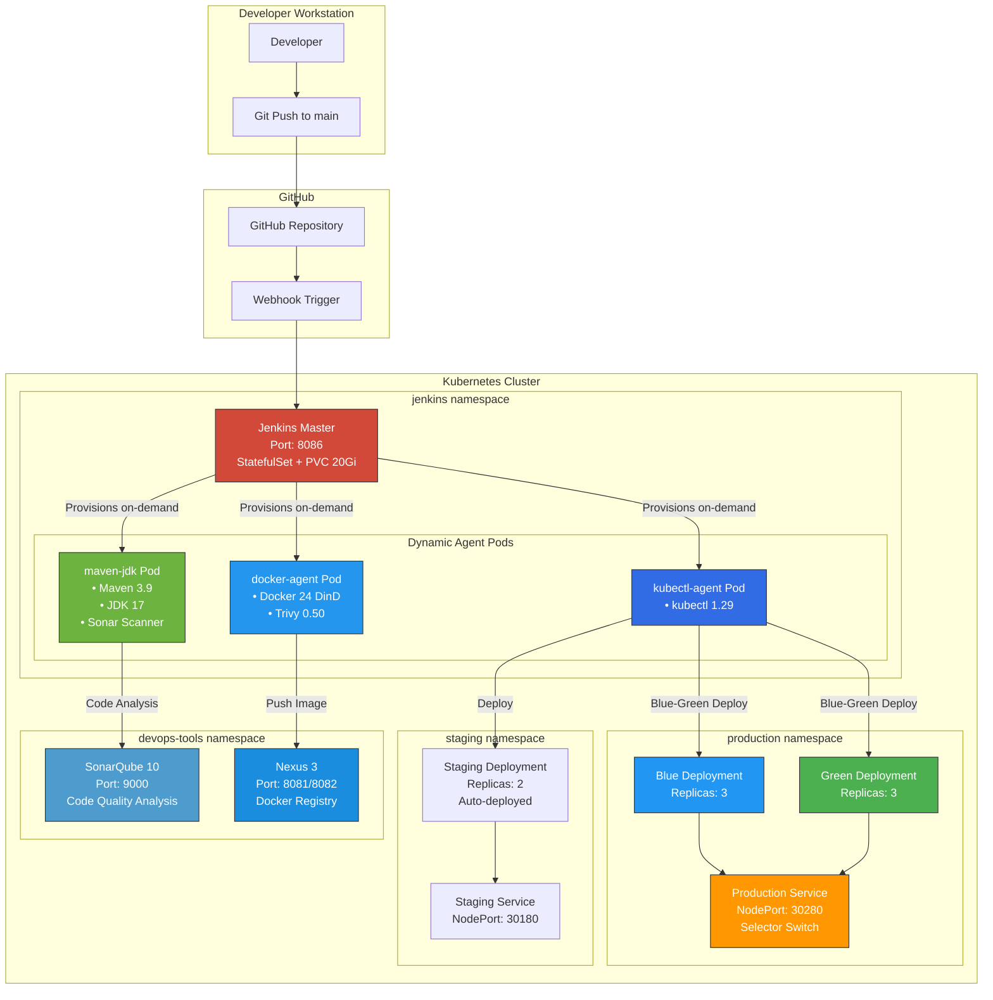
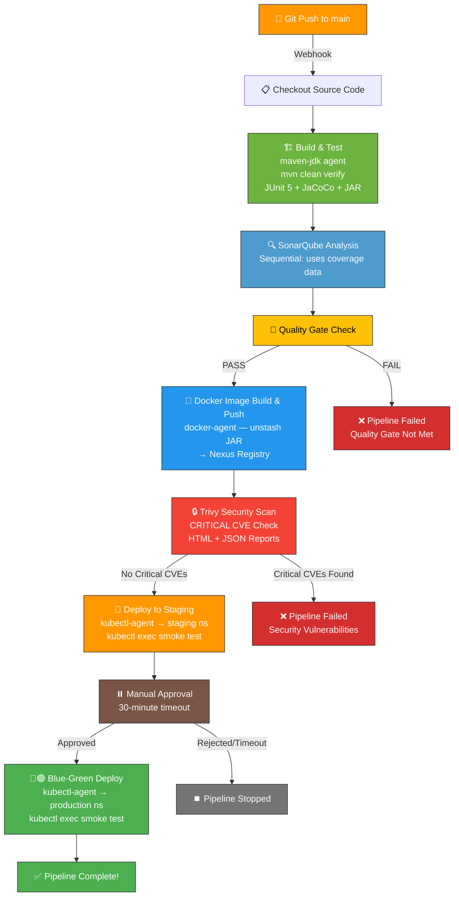
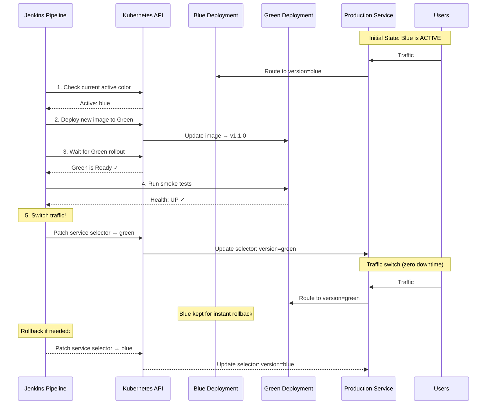
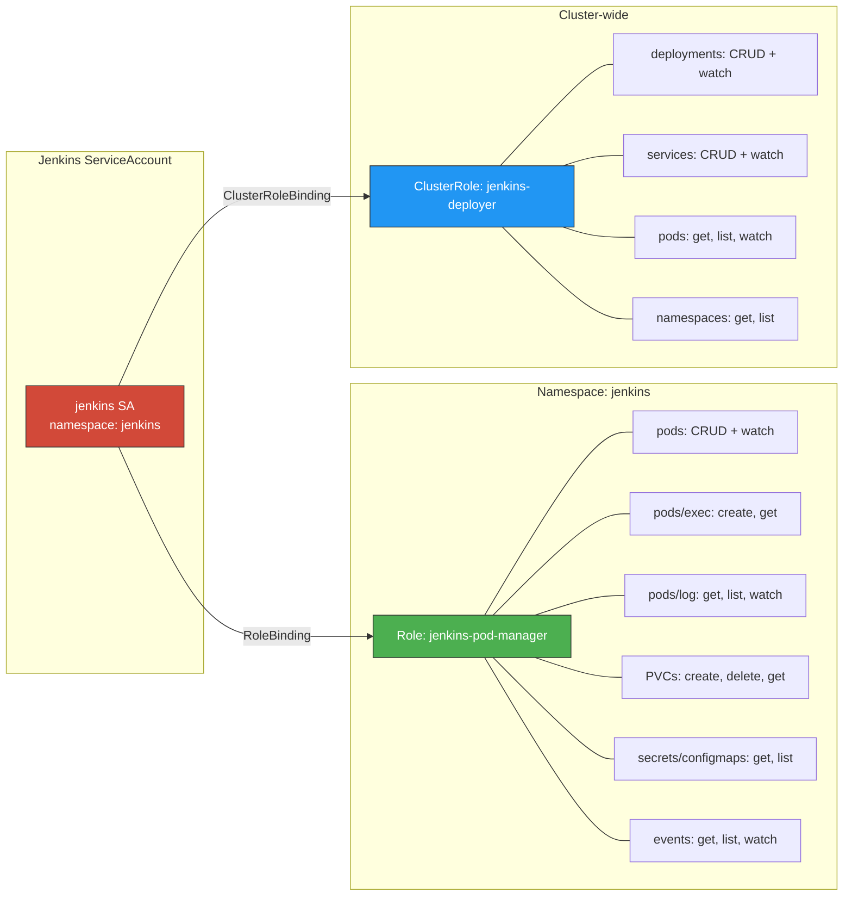

# 🏗️ Architecture Diagram

## System Architecture

```mermaid
graph TB
    subgraph "Developer Workstation"
        DEV[Developer]
        GIT[Git Push to main]
    end

    subgraph "GitHub"
        REPO[GitHub Repository]
        WEBHOOK[Webhook Trigger]
    end

    subgraph "Kubernetes Cluster"
        subgraph "jenkins namespace"
            JM[Jenkins Master<br/>Port: 8086<br/>StatefulSet + PVC 20Gi]
            
            subgraph "Dynamic Agent Pods"
                MVN[maven-jdk Pod<br/>• Maven 3.9<br/>• JDK 17<br/>• Sonar Scanner]
                DKR[docker-agent Pod<br/>• Docker 24 DinD<br/>• Trivy 0.50]
                KCT[kubectl-agent Pod<br/>• kubectl 1.29]
            end
        end

        subgraph "devops-tools namespace"
            SQ[SonarQube 10<br/>Port: 9000<br/>Code Quality Analysis]
            NX[Nexus 3<br/>Port: 8081/8082<br/>Docker Registry]
        end

        subgraph "staging namespace"
            STGD[Staging Deployment<br/>Replicas: 2<br/>Auto-deployed]
            STGS[Staging Service<br/>NodePort: 30180]
        end

        subgraph "production namespace"
            BLUED[Blue Deployment<br/>Replicas: 3]
            GREEND[Green Deployment<br/>Replicas: 3]
            PRODS[Production Service<br/>NodePort: 30280<br/>Selector Switch]
        end
    end

    DEV --> GIT
    GIT --> REPO
    REPO --> WEBHOOK
    WEBHOOK --> JM

    JM -->|"Provisions on-demand"| MVN
    JM -->|"Provisions on-demand"| DKR
    JM -->|"Provisions on-demand"| KCT

    MVN -->|"Code Analysis"| SQ
    DKR -->|"Push Image"| NX
    KCT -->|"Deploy"| STGD
    KCT -->|"Blue-Green Deploy"| BLUED
    KCT -->|"Blue-Green Deploy"| GREEND

    STGD --> STGS
    BLUED --> PRODS
    GREEND --> PRODS

    style JM fill:#D24939,stroke:#333,color:#fff
    style SQ fill:#4E9BCD,stroke:#333,color:#fff
    style NX fill:#1B8DDE,stroke:#333,color:#fff
    style MVN fill:#6DB33F,stroke:#333,color:#fff
    style DKR fill:#2496ED,stroke:#333,color:#fff
    style KCT fill:#326CE5,stroke:#333,color:#fff
    style BLUED fill:#2196F3,stroke:#333,color:#fff
    style GREEND fill:#4CAF50,stroke:#333,color:#fff
    style PRODS fill:#FF9800,stroke:#333,color:#fff
```

## Pipeline Flow

```mermaid
flowchart TD
    A[🔄 Git Push to main] -->|Webhook| B[📋 Checkout Source Code]
    B --> C[🏗️ Build & Test<br/>maven-jdk agent<br/>mvn clean verify<br/>JUnit 5 + JaCoCo + JAR]
    
    C --> F[🔍 SonarQube Analysis<br/>Sequential: uses coverage data]
    
    F --> G[🚦 Quality Gate Check]
    
    G -->|PASS| I[🐳 Docker Image Build & Push<br/>docker-agent — unstash JAR<br/>→ Nexus Registry]
    G -->|FAIL| X[❌ Pipeline Failed<br/>Quality Gate Not Met]
    
    I --> J[🔒 Trivy Security Scan<br/>CRITICAL CVE Check<br/>HTML + JSON Reports]
    
    J -->|No Critical CVEs| K[🚀 Deploy to Staging<br/>kubectl-agent → staging ns<br/>kubectl exec smoke test]
    J -->|Critical CVEs Found| Y[❌ Pipeline Failed<br/>Security Vulnerabilities]
    
    K --> L[⏸️ Manual Approval<br/>30-minute timeout]
    
    L -->|Approved| M[🔵🟢 Blue-Green Deploy<br/>kubectl-agent → production ns<br/>kubectl exec smoke test]
    L -->|Rejected/Timeout| Z[⏹️ Pipeline Stopped]
    
    M --> N[✅ Pipeline Complete!]

    style A fill:#FF9800,stroke:#333,color:#fff
    style C fill:#6DB33F,stroke:#333,color:#fff
    style F fill:#4E9BCD,stroke:#333,color:#fff
    style G fill:#FFC107,stroke:#333,color:#000
    style I fill:#2496ED,stroke:#333,color:#fff
    style J fill:#F44336,stroke:#333,color:#fff
    style K fill:#FF9800,stroke:#333,color:#fff
    style L fill:#795548,stroke:#333,color:#fff
    style M fill:#4CAF50,stroke:#333,color:#fff
    style N fill:#4CAF50,stroke:#333,color:#fff
    style X fill:#D32F2F,stroke:#333,color:#fff
    style Y fill:#D32F2F,stroke:#333,color:#fff
    style Z fill:#757575,stroke:#333,color:#fff
```

## Blue-Green Deployment Strategy

```mermaid
sequenceDiagram
    participant J as Jenkins Pipeline
    participant K as Kubernetes API
    participant B as Blue Deployment
    participant G as Green Deployment
    participant S as Production Service
    participant U as Users

    Note over S,U: Initial State: Blue is ACTIVE
    U->>S: Traffic
    S->>B: Route to version=blue

    J->>K: 1. Check current active color
    K-->>J: Active: blue

    J->>K: 2. Deploy new image to Green
    K->>G: Update image → v1.1.0
    
    J->>K: 3. Wait for Green rollout
    K-->>J: Green is Ready ✓
    
    J->>G: 4. Run smoke tests
    G-->>J: Health: UP ✓
    
    Note over J: 5. Switch traffic!
    J->>K: Patch service selector → green
    K->>S: Update selector: version=green
    
    Note over S,U: Traffic switch (zero downtime)
    U->>S: Traffic
    S->>G: Route to version=green
    
    Note over B: Blue kept for instant rollback
    
    Note over J: Rollback if needed:
    J-->>K: Patch service selector → blue
    K-->>S: Update selector: version=blue
```

## RBAC Permissions Model

```mermaid
graph LR
    subgraph "Jenkins ServiceAccount"
        SA[jenkins SA<br/>namespace: jenkins]
    end

    subgraph "Namespace: jenkins"
        R1[Role: jenkins-pod-manager]
        R1 --- P1[pods: CRUD + watch]
        R1 --- P2[pods/exec: create, get]
        R1 --- P3[pods/log: get, list, watch]
        R1 --- P4[PVCs: create, delete, get]
        R1 --- P5[secrets/configmaps: get, list]
        R1 --- P6[events: get, list, watch]
    end

    subgraph "Cluster-wide"
        CR[ClusterRole: jenkins-deployer]
        CR --- CP1[deployments: CRUD + watch]
        CR --- CP2[services: CRUD + watch]
        CR --- CP3[pods: get, list, watch]
        CR --- CP4[namespaces: get, list]
    end

    SA -->|RoleBinding| R1
    SA -->|ClusterRoleBinding| CR

    style SA fill:#D24939,stroke:#333,color:#fff
    style R1 fill:#4CAF50,stroke:#333,color:#fff
    style CR fill:#2196F3,stroke:#333,color:#fff
```
